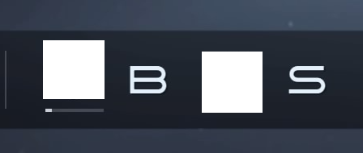

# Gran Turismo 7 Driver Rating Tracker

This is a GT7 Driver Ranking Tracker that uses PlayStations share feature to detect the value of the progress bar in the GT7 Sport menu. It is a very basic proof of concept and has some limitations. So far it is the only way to get numerical GT7 Sports mode driver rating.

In short:

* Take a screenshot on your PlayStation
* Share the screenshot with this script on your iOS device
* Get a numerical value for your current progress in your current driver rating class as text and a CSV file

[Kudosprime](https://www.kudosprime.com) has a similar solution. [It's description](https://www.kudosprime.com/gt7/sport_tracker.php?id=84405) gave the idea for this script. But this script does not need a USB drive. You will only need Pythonista and the PlayStation App on your iOS device.

The timestamp, value and max resolution of the driver rating data is stored in a CSV file in Pythonista's iCloud folder. You may open this folder on a Mac for working with the data.

Gran Turismo 7 Driver Rating Tracker is not affiliated with Sony, PlayStation or Gran Turismo.

## Setup

1. Install [Pythonista 3 on iOS](https://apps.apple.com/us/app/pythonista-3/id1085978097?ls=1) (9,99€)

2. Install [PlayStation App on iOS](https://apps.apple.com/de/app/playstation-app/id410896080) (free)

3. Turn on Auto-Upload of PlayStation Captures. See this [description](https://gamerant.com/playstation-app-screenshots-photos/).

4. In Pythonista

   1. Copy the script `gt7_driver_ranking.py` from [here](https://github.com/snipem/gt7_driver_ranking_image_recognition/blob/main/gt7_driver_ranking_image_recognition.py) to Pythonistas main folder (local or iCloud)
   2. Create a [Share Extension Shortcut](https://omz-software.com/pythonista/docs/ios/pythonista_shortcuts.html#pythonista-share-extension) in "Settings -> Share Extension Shortcut" for the script.

   

## Run

1. On your PlayStation
   1. Navigate to the GT Sport Menu, where you normally select Daily Races, Nations Cup and Manufacturers Cup
      1. 
      2. Make sure the screen shows the bar below your current Driver Rating (screenshot edited to not include possibly copyrighted material)
   2. Take a screenshot (Share Button)
   3. (Wait for the screenshot to be uploaded. Since GT7 has an online connection, the upload is slow)
2. In your PlayStation App:
   1. Select the recently uploaded screenshot from the screenshot gallery
   2. Click the share button on the left hand side
   3. Select the share button at the bottom, to share with other iOS apps
   4. Select "Run Pythonista Script"
   5. Select the shortcut you created in Step 3 of the setup instructions

## Limitations

* Currently only works for PS5 and PS4 Pro resolutions (3840x2160), PS4 is not supported.
* Driver rating is not detected yet.
* Since the progress bar does only consist of 72 pixels the maximum data resolution is 72. 

### How can I help?

* Provide me with uncompressed screenshots from the app of 
  * other driver ratings than B and I can add driver rating class detection.
  * A screenshot from PS4

## Development Info

### Fonts used for Driver Rating classes

Seems to be Ateros Regular: https://www.myfonts.com/products/regular-ateros-19049
